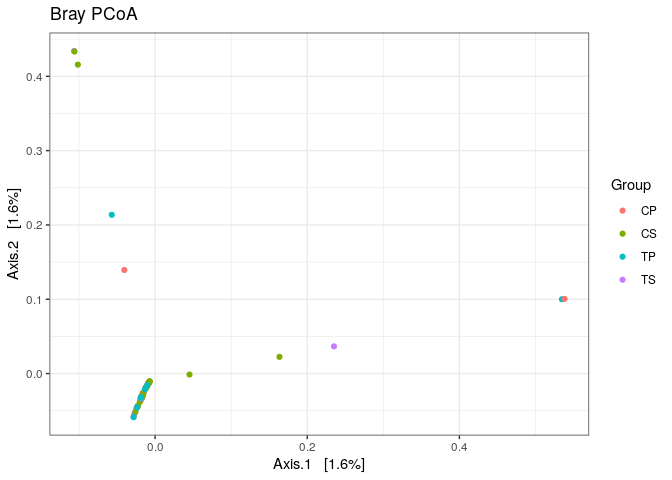

CC3
================

  - [Filtration des données](#filtration-des-données)
  - [Débruitage des données](#débruitage-des-données)
  - [Paires de reads](#paires-de-reads)
  - [Chimères](#chimères)
  - [Taxonomie](#taxonomie)
  - [Phyloseq](#phyloseq)
  - [Alpha diversité](#alpha-diversité)
  - [PCoA](#pcoa)
  - [Distribution des bactéries
    prédominantes](#distribution-des-bactéries-prédominantes)
  - [Diagramme de Venn](#diagramme-de-venn)
  - [Conclusion](#conclusion)

\#Les données

Les séquences sont chargées à partir de European Nucleotide Archive puis
elles sont dézipées. Tout cela dans le “01\_downloadingdata.Rmd”. Les
métadatas sont aussi chargées.

Ne trouvant pas le dossier, j’utilise la commande “file.choose()” pour
le choisir manuellement.

``` r
path <- "~/CC3"
list.files(path)
```

    ##   [1] "00_packageinstall.Rmd"      "01_downloadingdata.nb.html"
    ##   [3] "01_downloadingdata.Rmd"     "CC3.Rmd"                   
    ##   [5] "CC3.Rproj"                  "filtered"                  
    ##   [7] "README.md"                  "SRR8003020_1.fastq"        
    ##   [9] "SRR8003020_2.fastq"         "SRR8003021_1.fastq"        
    ##  [11] "SRR8003021_2.fastq"         "SRR8003022_1.fastq"        
    ##  [13] "SRR8003022_2.fastq"         "SRR8003023_1.fastq"        
    ##  [15] "SRR8003023_2.fastq"         "SRR8003024_1.fastq"        
    ##  [17] "SRR8003024_2.fastq"         "SRR8003025_1.fastq"        
    ##  [19] "SRR8003025_2.fastq"         "SRR8003026_1.fastq"        
    ##  [21] "SRR8003026_2.fastq"         "SRR8003027_1.fastq"        
    ##  [23] "SRR8003027_2.fastq"         "SRR8003028_1.fastq"        
    ##  [25] "SRR8003028_2.fastq"         "SRR8003029_1.fastq"        
    ##  [27] "SRR8003029_2.fastq"         "SRR8003030_1.fastq"        
    ##  [29] "SRR8003030_2.fastq"         "SRR8003031_1.fastq"        
    ##  [31] "SRR8003031_2.fastq"         "SRR8003032_1.fastq"        
    ##  [33] "SRR8003032_2.fastq"         "SRR8003033_1.fastq"        
    ##  [35] "SRR8003033_2.fastq"         "SRR8003034_1.fastq"        
    ##  [37] "SRR8003034_2.fastq"         "SRR8003036_1.fastq"        
    ##  [39] "SRR8003036_2.fastq"         "SRR8003037_1.fastq"        
    ##  [41] "SRR8003037_2.fastq"         "SRR8003038_1.fastq"        
    ##  [43] "SRR8003038_2.fastq"         "SRR8003039_1.fastq"        
    ##  [45] "SRR8003039_2.fastq"         "SRR8003040_1.fastq"        
    ##  [47] "SRR8003040_2.fastq"         "SRR8003041_1.fastq"        
    ##  [49] "SRR8003041_2.fastq"         "SRR8003042_1.fastq"        
    ##  [51] "SRR8003042_2.fastq"         "SRR8003043_1.fastq"        
    ##  [53] "SRR8003043_2.fastq"         "SRR8003044_1.fastq"        
    ##  [55] "SRR8003044_2.fastq"         "SRR8003045_1.fastq"        
    ##  [57] "SRR8003045_2.fastq"         "SRR8003046_1.fastq"        
    ##  [59] "SRR8003046_2.fastq"         "SRR8003047_1.fastq"        
    ##  [61] "SRR8003047_2.fastq"         "SRR8003048_1.fastq"        
    ##  [63] "SRR8003048_2.fastq"         "SRR8003049_1.fastq"        
    ##  [65] "SRR8003049_2.fastq"         "SRR8003050_1.fastq"        
    ##  [67] "SRR8003050_2.fastq"         "SRR8003051_1.fastq"        
    ##  [69] "SRR8003051_2.fastq"         "SRR8003052_1.fastq"        
    ##  [71] "SRR8003052_2.fastq"         "SRR8003053_1.fastq"        
    ##  [73] "SRR8003053_2.fastq"         "SRR8003054_1.fastq"        
    ##  [75] "SRR8003054_2.fastq"         "SRR8003055_1.fastq"        
    ##  [77] "SRR8003055_2.fastq"         "SRR8003056_1.fastq"        
    ##  [79] "SRR8003056_2.fastq"         "SRR8003057_1.fastq"        
    ##  [81] "SRR8003057_2.fastq"         "SRR8003058_1.fastq"        
    ##  [83] "SRR8003058_2.fastq"         "SRR8003059_1.fastq"        
    ##  [85] "SRR8003059_2.fastq"         "SRR8003060_1.fastq"        
    ##  [87] "SRR8003060_2.fastq"         "SRR8003061_1.fastq"        
    ##  [89] "SRR8003061_2.fastq"         "SRR8003062_1.fastq"        
    ##  [91] "SRR8003062_2.fastq"         "SRR8003063_1.fastq"        
    ##  [93] "SRR8003063_2.fastq"         "SRR8003064_1.fastq"        
    ##  [95] "SRR8003064_2.fastq"         "SRR8003065_1.fastq"        
    ##  [97] "SRR8003065_2.fastq"         "SRR8003066_1.fastq"        
    ##  [99] "SRR8003066_2.fastq"         "SRR8003067_1.fastq"        
    ## [101] "SRR8003067_2.fastq"         "SRR8003068_1.fastq"        
    ## [103] "SRR8003068_2.fastq"         "SRR8003069_1.fastq"        
    ## [105] "SRR8003069_2.fastq"         "SRR8003070_1.fastq"        
    ## [107] "SRR8003070_2.fastq"         "SRR8003071_1.fastq"        
    ## [109] "SRR8003071_2.fastq"         "SRR8003072_1.fastq"        
    ## [111] "SRR8003072_2.fastq"         "SRR8003073_1.fastq"        
    ## [113] "SRR8003073_2.fastq"         "SRR8003074_1.fastq"        
    ## [115] "SRR8003074_2.fastq"         "SRR8003075_1.fastq"        
    ## [117] "SRR8003075_2.fastq"         "SRR8003076_1.fastq"        
    ## [119] "SRR8003076_2.fastq"         "SRR8003077_1.fastq"        
    ## [121] "SRR8003077_2.fastq"         "SRR8003078_1.fastq"        
    ## [123] "SRR8003078_2.fastq"         "SRR8003079_1.fastq"        
    ## [125] "SRR8003079_2.fastq"         "SRR8003080_1.fastq"        
    ## [127] "SRR8003080_2.fastq"         "SRR8003081_1.fastq"        
    ## [129] "SRR8003081_2.fastq"         "SRR8003082_1.fastq"        
    ## [131] "SRR8003082_2.fastq"         "SRR8003083_1.fastq"        
    ## [133] "SRR8003083_2.fastq"         "SRR8003084_1.fastq"        
    ## [135] "SRR8003084_2.fastq"         "SRR8003085_1.fastq"        
    ## [137] "SRR8003085_2.fastq"         "SRR8003086_1.fastq"        
    ## [139] "SRR8003086_2.fastq"         "SRR8003087_1.fastq"        
    ## [141] "SRR8003087_2.fastq"         "SRR8003088_1.fastq"        
    ## [143] "SRR8003088_2.fastq"         "SRR8003089_1.fastq"        
    ## [145] "SRR8003089_2.fastq"         "SRR8003090_1.fastq"        
    ## [147] "SRR8003090_2.fastq"         "SRR8003091_1.fastq"        
    ## [149] "SRR8003091_2.fastq"         "SRR8003092_1.fastq"        
    ## [151] "SRR8003092_2.fastq"         "SRR8003093_1.fastq"        
    ## [153] "SRR8003093_2.fastq"         "SRR8003094_1.fastq"        
    ## [155] "SRR8003094_2.fastq"         "SRR8003095_1.fastq"        
    ## [157] "SRR8003095_2.fastq"         "SRR8003096_1.fastq"        
    ## [159] "SRR8003096_2.fastq"         "SRR8003097_1.fastq"        
    ## [161] "SRR8003097_2.fastq"         "SRR8003098_1.fastq"        
    ## [163] "SRR8003098_2.fastq"         "SRR8003099_1.fastq"        
    ## [165] "SRR8003099_2.fastq"         "SRR8003100_1.fastq"        
    ## [167] "SRR8003100_2.fastq"         "SRR8003101_1.fastq"        
    ## [169] "SRR8003101_2.fastq"         "SRR8003102_1.fastq"        
    ## [171] "SRR8003102_2.fastq"         "SRR8003103_1.fastq"        
    ## [173] "SRR8003103_2.fastq"         "SRR8003104_1.fastq"        
    ## [175] "SRR8003104_2.fastq"         "SRR8003105_1.fastq"        
    ## [177] "SRR8003105_2.fastq"         "SRR8003106_1.fastq"        
    ## [179] "SRR8003106_2.fastq"         "SRR8003107_1.fastq"        
    ## [181] "SRR8003107_2.fastq"         "SRR8003108_1.fastq"        
    ## [183] "SRR8003108_2.fastq"         "SRR8003109_1.fastq"        
    ## [185] "SRR8003109_2.fastq"         "uter_metadata.csv"         
    ## [187] "uter_metadata.txt"

Les Forwards et les Reverses sont séparés.

``` r
fnFs <- sort(list.files(path, pattern="_1.fastq", full.names = TRUE))
fnRs <- sort(list.files(path, pattern="_2.fastq", full.names = TRUE))

sample.names <- sapply(strsplit(basename(fnFs), "_"), `[`, 1)
```

## Filtration des données

``` r
library("dada2")
```

    ## Loading required package: Rcpp

Les profils de qualités sont plottés pour les 6 premiers fichiers fastq.

``` r
plotQualityProfile(fnFs[1:6])
```

<!-- -->

Les profils de qualité des Forwards sont bons, il faudrait trimer vers
290.

``` r
plotQualityProfile(fnRs[1:6])
```

<!-- -->

Les plots de qualité des Reverses sont beaucoup moins bons que ceux des
Forwards, comme on pouvait s’y attendre. Nous allons donc trimer vers
200.

``` r
filtFs <- file.path(path,"filtered", paste0(sample.names, "_F_filt.fasta.gz"))
filtRs <- file.path(path,"filtered", paste0(sample.names, "_R_filt.fasta.gz"))
names(filtFs) <- sample.names
names(filtRs) <- sample.names
```

``` r
out <- filterAndTrim(fnFs, filtFs, fnRs, filtRs, truncLen=c(290,200),
              maxN=0, maxEE=c(2,2), truncQ=2, rm.phix=TRUE,
              compress=TRUE, multithread=TRUE)
head(out)
```

    ##                    reads.in reads.out
    ## SRR8003020_1.fastq    17318     16154
    ## SRR8003021_1.fastq    20995     19989
    ## SRR8003022_1.fastq    23088     21405
    ## SRR8003023_1.fastq    20676     19395
    ## SRR8003024_1.fastq    23047     21715
    ## SRR8003025_1.fastq    25294     23729

## Débruitage des données

On calcule les taux d’erreurs.

``` r
errF <- learnErrors(filtFs, multithread=TRUE)
```

    ## 105223890 total bases in 362841 reads from 18 samples will be used for learning the error rates.

``` r
errR <- learnErrors(filtRs, multithread=TRUE)
```

    ## 100513600 total bases in 502568 reads from 26 samples will be used for learning the error rates.

Puis on visualise les taux d’erreurs.

``` r
plotErrors(errF, nominalQ=TRUE)
```

    ## Warning: Transformation introduced infinite values in continuous y-axis

<!-- -->

``` r
plotErrors(errR, nominalQ=TRUE)
```

    ## Warning: Transformation introduced infinite values in continuous y-axis
    
    ## Warning: Transformation introduced infinite values in continuous y-axis

<!-- -->

Et on débruite avec dada.

``` r
dadaFs <- dada(filtFs, err=errF, multithread=TRUE)
```

    ## Sample 1 - 16154 reads in 5344 unique sequences.
    ## Sample 2 - 19989 reads in 6570 unique sequences.
    ## Sample 3 - 21405 reads in 7463 unique sequences.
    ## Sample 4 - 19395 reads in 6066 unique sequences.
    ## Sample 5 - 21715 reads in 7172 unique sequences.
    ## Sample 6 - 23729 reads in 9154 unique sequences.
    ## Sample 7 - 20825 reads in 7128 unique sequences.
    ## Sample 8 - 20813 reads in 7439 unique sequences.
    ## Sample 9 - 19413 reads in 7296 unique sequences.
    ## Sample 10 - 20277 reads in 6656 unique sequences.
    ## Sample 11 - 18859 reads in 6643 unique sequences.
    ## Sample 12 - 19460 reads in 6449 unique sequences.
    ## Sample 13 - 21597 reads in 9142 unique sequences.
    ## Sample 14 - 21670 reads in 7674 unique sequences.
    ## Sample 15 - 19101 reads in 9961 unique sequences.
    ## Sample 16 - 21210 reads in 8453 unique sequences.
    ## Sample 17 - 18920 reads in 6868 unique sequences.
    ## Sample 18 - 18309 reads in 6819 unique sequences.
    ## Sample 19 - 17895 reads in 6079 unique sequences.
    ## Sample 20 - 18659 reads in 6728 unique sequences.
    ## Sample 21 - 14913 reads in 5521 unique sequences.
    ## Sample 22 - 16434 reads in 6217 unique sequences.
    ## Sample 23 - 16047 reads in 5796 unique sequences.
    ## Sample 24 - 17482 reads in 6056 unique sequences.
    ## Sample 25 - 23059 reads in 8232 unique sequences.
    ## Sample 26 - 15238 reads in 5096 unique sequences.
    ## Sample 27 - 13441 reads in 5049 unique sequences.
    ## Sample 28 - 15909 reads in 5251 unique sequences.
    ## Sample 29 - 16698 reads in 6504 unique sequences.
    ## Sample 30 - 20937 reads in 6569 unique sequences.
    ## Sample 31 - 18063 reads in 6670 unique sequences.
    ## Sample 32 - 20800 reads in 7949 unique sequences.
    ## Sample 33 - 20004 reads in 7849 unique sequences.
    ## Sample 34 - 15243 reads in 5080 unique sequences.
    ## Sample 35 - 23933 reads in 8827 unique sequences.
    ## Sample 36 - 17528 reads in 7211 unique sequences.
    ## Sample 37 - 19939 reads in 8484 unique sequences.
    ## Sample 38 - 24564 reads in 10546 unique sequences.
    ## Sample 39 - 18761 reads in 9081 unique sequences.
    ## Sample 40 - 21541 reads in 8185 unique sequences.
    ## Sample 41 - 19459 reads in 6744 unique sequences.
    ## Sample 42 - 21120 reads in 7740 unique sequences.
    ## Sample 43 - 19085 reads in 6218 unique sequences.
    ## Sample 44 - 15495 reads in 5286 unique sequences.
    ## Sample 45 - 20550 reads in 7380 unique sequences.
    ## Sample 46 - 18434 reads in 6665 unique sequences.
    ## Sample 47 - 21579 reads in 7513 unique sequences.
    ## Sample 48 - 13806 reads in 4626 unique sequences.
    ## Sample 49 - 18840 reads in 6833 unique sequences.
    ## Sample 50 - 24031 reads in 7719 unique sequences.
    ## Sample 51 - 23890 reads in 7979 unique sequences.
    ## Sample 52 - 22377 reads in 8257 unique sequences.
    ## Sample 53 - 16538 reads in 6353 unique sequences.
    ## Sample 54 - 22985 reads in 7865 unique sequences.
    ## Sample 55 - 21687 reads in 7285 unique sequences.
    ## Sample 56 - 17732 reads in 5697 unique sequences.
    ## Sample 57 - 19851 reads in 5458 unique sequences.
    ## Sample 58 - 17958 reads in 5447 unique sequences.
    ## Sample 59 - 21686 reads in 7919 unique sequences.
    ## Sample 60 - 20063 reads in 6306 unique sequences.
    ## Sample 61 - 14478 reads in 5386 unique sequences.
    ## Sample 62 - 17717 reads in 7030 unique sequences.
    ## Sample 63 - 21724 reads in 8386 unique sequences.
    ## Sample 64 - 28401 reads in 8607 unique sequences.
    ## Sample 65 - 15751 reads in 4694 unique sequences.
    ## Sample 66 - 19256 reads in 7109 unique sequences.
    ## Sample 67 - 20792 reads in 8248 unique sequences.
    ## Sample 68 - 22786 reads in 7515 unique sequences.
    ## Sample 69 - 20066 reads in 6660 unique sequences.
    ## Sample 70 - 21107 reads in 6436 unique sequences.
    ## Sample 71 - 20834 reads in 7717 unique sequences.
    ## Sample 72 - 19383 reads in 7005 unique sequences.
    ## Sample 73 - 25157 reads in 7483 unique sequences.
    ## Sample 74 - 20953 reads in 6557 unique sequences.
    ## Sample 75 - 23194 reads in 8381 unique sequences.
    ## Sample 76 - 23882 reads in 8568 unique sequences.
    ## Sample 77 - 19102 reads in 5490 unique sequences.
    ## Sample 78 - 19248 reads in 5598 unique sequences.
    ## Sample 79 - 22840 reads in 6997 unique sequences.
    ## Sample 80 - 24230 reads in 7601 unique sequences.
    ## Sample 81 - 18810 reads in 6132 unique sequences.
    ## Sample 82 - 19462 reads in 7270 unique sequences.
    ## Sample 83 - 21532 reads in 7638 unique sequences.
    ## Sample 84 - 22858 reads in 8351 unique sequences.
    ## Sample 85 - 14961 reads in 5454 unique sequences.
    ## Sample 86 - 18510 reads in 6684 unique sequences.
    ## Sample 87 - 15675 reads in 5796 unique sequences.
    ## Sample 88 - 21113 reads in 7081 unique sequences.
    ## Sample 89 - 19009 reads in 6672 unique sequences.

``` r
dadaRs <- dada(filtRs, err=errR, multithread=TRUE)
```

    ## Sample 1 - 16154 reads in 5561 unique sequences.
    ## Sample 2 - 19989 reads in 6501 unique sequences.
    ## Sample 3 - 21405 reads in 7520 unique sequences.
    ## Sample 4 - 19395 reads in 6901 unique sequences.
    ## Sample 5 - 21715 reads in 7256 unique sequences.
    ## Sample 6 - 23729 reads in 8637 unique sequences.
    ## Sample 7 - 20825 reads in 6939 unique sequences.
    ## Sample 8 - 20813 reads in 7099 unique sequences.
    ## Sample 9 - 19413 reads in 7251 unique sequences.
    ## Sample 10 - 20277 reads in 7199 unique sequences.
    ## Sample 11 - 18859 reads in 7499 unique sequences.
    ## Sample 12 - 19460 reads in 7168 unique sequences.
    ## Sample 13 - 21597 reads in 9109 unique sequences.
    ## Sample 14 - 21670 reads in 8317 unique sequences.
    ## Sample 15 - 19101 reads in 9004 unique sequences.
    ## Sample 16 - 21210 reads in 8130 unique sequences.
    ## Sample 17 - 18920 reads in 6701 unique sequences.
    ## Sample 18 - 18309 reads in 6528 unique sequences.
    ## Sample 19 - 17895 reads in 5904 unique sequences.
    ## Sample 20 - 18659 reads in 7255 unique sequences.
    ## Sample 21 - 14913 reads in 5641 unique sequences.
    ## Sample 22 - 16434 reads in 6680 unique sequences.
    ## Sample 23 - 16047 reads in 5948 unique sequences.
    ## Sample 24 - 17482 reads in 6817 unique sequences.
    ## Sample 25 - 23059 reads in 8383 unique sequences.
    ## Sample 26 - 15238 reads in 5776 unique sequences.
    ## Sample 27 - 13441 reads in 5705 unique sequences.
    ## Sample 28 - 15909 reads in 5808 unique sequences.
    ## Sample 29 - 16698 reads in 6953 unique sequences.
    ## Sample 30 - 20937 reads in 7004 unique sequences.
    ## Sample 31 - 18063 reads in 7014 unique sequences.
    ## Sample 32 - 20800 reads in 8054 unique sequences.
    ## Sample 33 - 20004 reads in 7649 unique sequences.
    ## Sample 34 - 15243 reads in 5503 unique sequences.
    ## Sample 35 - 23933 reads in 8427 unique sequences.
    ## Sample 36 - 17528 reads in 6078 unique sequences.
    ## Sample 37 - 19939 reads in 7541 unique sequences.
    ## Sample 38 - 24564 reads in 8873 unique sequences.
    ## Sample 39 - 18761 reads in 7599 unique sequences.
    ## Sample 40 - 21541 reads in 8332 unique sequences.
    ## Sample 41 - 19459 reads in 6863 unique sequences.
    ## Sample 42 - 21120 reads in 8308 unique sequences.
    ## Sample 43 - 19085 reads in 6324 unique sequences.
    ## Sample 44 - 15495 reads in 5820 unique sequences.
    ## Sample 45 - 20550 reads in 8132 unique sequences.
    ## Sample 46 - 18434 reads in 7475 unique sequences.
    ## Sample 47 - 21579 reads in 8659 unique sequences.
    ## Sample 48 - 13806 reads in 5393 unique sequences.
    ## Sample 49 - 18840 reads in 7055 unique sequences.
    ## Sample 50 - 24031 reads in 7555 unique sequences.
    ## Sample 51 - 23890 reads in 7912 unique sequences.
    ## Sample 52 - 22377 reads in 8076 unique sequences.
    ## Sample 53 - 16538 reads in 6318 unique sequences.
    ## Sample 54 - 22985 reads in 8245 unique sequences.
    ## Sample 55 - 21687 reads in 6745 unique sequences.
    ## Sample 56 - 17732 reads in 6215 unique sequences.
    ## Sample 57 - 19851 reads in 5558 unique sequences.
    ## Sample 58 - 17958 reads in 5952 unique sequences.
    ## Sample 59 - 21686 reads in 7174 unique sequences.
    ## Sample 60 - 20063 reads in 6955 unique sequences.
    ## Sample 61 - 14478 reads in 5650 unique sequences.
    ## Sample 62 - 17717 reads in 5929 unique sequences.
    ## Sample 63 - 21724 reads in 6813 unique sequences.
    ## Sample 64 - 28401 reads in 7706 unique sequences.
    ## Sample 65 - 15751 reads in 3958 unique sequences.
    ## Sample 66 - 19256 reads in 6220 unique sequences.
    ## Sample 67 - 20792 reads in 8428 unique sequences.
    ## Sample 68 - 22786 reads in 7790 unique sequences.
    ## Sample 69 - 20066 reads in 6781 unique sequences.
    ## Sample 70 - 21107 reads in 6551 unique sequences.
    ## Sample 71 - 20834 reads in 8700 unique sequences.
    ## Sample 72 - 19383 reads in 6963 unique sequences.
    ## Sample 73 - 25157 reads in 7686 unique sequences.
    ## Sample 74 - 20953 reads in 7325 unique sequences.
    ## Sample 75 - 23194 reads in 9097 unique sequences.
    ## Sample 76 - 23882 reads in 8570 unique sequences.
    ## Sample 77 - 19102 reads in 6036 unique sequences.
    ## Sample 78 - 19248 reads in 6484 unique sequences.
    ## Sample 79 - 22840 reads in 7068 unique sequences.
    ## Sample 80 - 24230 reads in 8014 unique sequences.
    ## Sample 81 - 18810 reads in 6315 unique sequences.
    ## Sample 82 - 19462 reads in 7824 unique sequences.
    ## Sample 83 - 21532 reads in 7527 unique sequences.
    ## Sample 84 - 22858 reads in 7636 unique sequences.
    ## Sample 85 - 14961 reads in 5642 unique sequences.
    ## Sample 86 - 18510 reads in 6516 unique sequences.
    ## Sample 87 - 15675 reads in 6039 unique sequences.
    ## Sample 88 - 21113 reads in 6725 unique sequences.
    ## Sample 89 - 19009 reads in 6938 unique sequences.

## Paires de reads

On lie les paires de reads.

``` r
mergers <- mergePairs(dadaFs, filtFs, dadaRs, filtRs, verbose=TRUE)
```

    ## 7739 paired-reads (in 232 unique pairings) successfully merged out of 15491 (in 745 pairings) input.

    ## 6854 paired-reads (in 261 unique pairings) successfully merged out of 19340 (in 942 pairings) input.

    ## 12335 paired-reads (in 622 unique pairings) successfully merged out of 20193 (in 1578 pairings) input.

    ## 12267 paired-reads (in 320 unique pairings) successfully merged out of 18519 (in 644 pairings) input.

    ## 14177 paired-reads (in 469 unique pairings) successfully merged out of 20290 (in 852 pairings) input.

    ## 13453 paired-reads (in 826 unique pairings) successfully merged out of 21836 (in 1963 pairings) input.

    ## 10948 paired-reads (in 459 unique pairings) successfully merged out of 19868 (in 1453 pairings) input.

    ## 13106 paired-reads (in 809 unique pairings) successfully merged out of 19544 (in 1642 pairings) input.

    ## 12404 paired-reads (in 968 unique pairings) successfully merged out of 18245 (in 1767 pairings) input.

    ## 10187 paired-reads (in 383 unique pairings) successfully merged out of 19338 (in 1050 pairings) input.

    ## 10282 paired-reads (in 362 unique pairings) successfully merged out of 17995 (in 745 pairings) input.

    ## 9885 paired-reads (in 349 unique pairings) successfully merged out of 18517 (in 1282 pairings) input.

    ## 12428 paired-reads (in 698 unique pairings) successfully merged out of 19892 (in 1717 pairings) input.

    ## 14541 paired-reads (in 754 unique pairings) successfully merged out of 20440 (in 1246 pairings) input.

    ## 9826 paired-reads (in 1072 unique pairings) successfully merged out of 15933 (in 3167 pairings) input.

    ## 14572 paired-reads (in 924 unique pairings) successfully merged out of 19414 (in 1979 pairings) input.

    ## 7464 paired-reads (in 434 unique pairings) successfully merged out of 17915 (in 1456 pairings) input.

    ## 11722 paired-reads (in 700 unique pairings) successfully merged out of 16988 (in 1544 pairings) input.

    ## 11001 paired-reads (in 560 unique pairings) successfully merged out of 16907 (in 1364 pairings) input.

    ## 11217 paired-reads (in 402 unique pairings) successfully merged out of 17694 (in 909 pairings) input.

    ## 8193 paired-reads (in 305 unique pairings) successfully merged out of 14319 (in 714 pairings) input.

    ## 5743 paired-reads (in 177 unique pairings) successfully merged out of 15731 (in 762 pairings) input.

    ## 6941 paired-reads (in 275 unique pairings) successfully merged out of 15211 (in 938 pairings) input.

    ## 7883 paired-reads (in 396 unique pairings) successfully merged out of 16770 (in 847 pairings) input.

    ## 6607 paired-reads (in 428 unique pairings) successfully merged out of 21663 (in 2191 pairings) input.

    ## 5122 paired-reads (in 172 unique pairings) successfully merged out of 14729 (in 619 pairings) input.

    ## 6633 paired-reads (in 249 unique pairings) successfully merged out of 12722 (in 676 pairings) input.

    ## 5810 paired-reads (in 196 unique pairings) successfully merged out of 15385 (in 751 pairings) input.

    ## 6749 paired-reads (in 236 unique pairings) successfully merged out of 15968 (in 848 pairings) input.

    ## 7430 paired-reads (in 308 unique pairings) successfully merged out of 20097 (in 993 pairings) input.

    ## 11851 paired-reads (in 428 unique pairings) successfully merged out of 17323 (in 773 pairings) input.

    ## 12896 paired-reads (in 612 unique pairings) successfully merged out of 19202 (in 1404 pairings) input.

    ## 13119 paired-reads (in 733 unique pairings) successfully merged out of 18445 (in 1379 pairings) input.

    ## 6260 paired-reads (in 194 unique pairings) successfully merged out of 14408 (in 584 pairings) input.

    ## 13871 paired-reads (in 764 unique pairings) successfully merged out of 22386 (in 1891 pairings) input.

    ## 5808 paired-reads (in 659 unique pairings) successfully merged out of 15943 (in 2698 pairings) input.

    ## 8136 paired-reads (in 793 unique pairings) successfully merged out of 17446 (in 3374 pairings) input.

    ## 10857 paired-reads (in 1387 unique pairings) successfully merged out of 22156 (in 4538 pairings) input.

    ## 10524 paired-reads (in 1325 unique pairings) successfully merged out of 16503 (in 3332 pairings) input.

    ## 11908 paired-reads (in 574 unique pairings) successfully merged out of 20572 (in 1498 pairings) input.

    ## 9439 paired-reads (in 444 unique pairings) successfully merged out of 18860 (in 1157 pairings) input.

    ## 7946 paired-reads (in 335 unique pairings) successfully merged out of 19972 (in 1314 pairings) input.

    ## 6204 paired-reads (in 221 unique pairings) successfully merged out of 18388 (in 1002 pairings) input.

    ## 4000 paired-reads (in 129 unique pairings) successfully merged out of 14865 (in 861 pairings) input.

    ## 8472 paired-reads (in 340 unique pairings) successfully merged out of 19651 (in 966 pairings) input.

    ## 8980 paired-reads (in 508 unique pairings) successfully merged out of 17550 (in 1096 pairings) input.

    ## 8409 paired-reads (in 392 unique pairings) successfully merged out of 20554 (in 1147 pairings) input.

    ## 6505 paired-reads (in 295 unique pairings) successfully merged out of 13289 (in 608 pairings) input.

    ## 5761 paired-reads (in 255 unique pairings) successfully merged out of 17987 (in 982 pairings) input.

    ## 12078 paired-reads (in 534 unique pairings) successfully merged out of 22170 (in 1469 pairings) input.

    ## 15212 paired-reads (in 709 unique pairings) successfully merged out of 22620 (in 1508 pairings) input.

    ## 11680 paired-reads (in 480 unique pairings) successfully merged out of 20925 (in 1415 pairings) input.

    ## 10449 paired-reads (in 537 unique pairings) successfully merged out of 15433 (in 1175 pairings) input.

    ## 15445 paired-reads (in 470 unique pairings) successfully merged out of 22074 (in 887 pairings) input.

    ## 12419 paired-reads (in 672 unique pairings) successfully merged out of 20267 (in 1653 pairings) input.

    ## 11785 paired-reads (in 343 unique pairings) successfully merged out of 17064 (in 646 pairings) input.

    ## 9152 paired-reads (in 319 unique pairings) successfully merged out of 19447 (in 614 pairings) input.

    ## 11909 paired-reads (in 300 unique pairings) successfully merged out of 17512 (in 622 pairings) input.

    ## 12950 paired-reads (in 1070 unique pairings) successfully merged out of 20012 (in 2384 pairings) input.

    ## 7592 paired-reads (in 243 unique pairings) successfully merged out of 19472 (in 917 pairings) input.

    ## 4656 paired-reads (in 308 unique pairings) successfully merged out of 13003 (in 1717 pairings) input.

    ## 9993 paired-reads (in 2126 unique pairings) successfully merged out of 16571 (in 3897 pairings) input.

    ## 6434 paired-reads (in 1080 unique pairings) successfully merged out of 19996 (in 3874 pairings) input.

    ## 9830 paired-reads (in 767 unique pairings) successfully merged out of 26924 (in 2994 pairings) input.

    ## 3005 paired-reads (in 239 unique pairings) successfully merged out of 14874 (in 1905 pairings) input.

    ## 5822 paired-reads (in 841 unique pairings) successfully merged out of 17978 (in 3261 pairings) input.

    ## 10260 paired-reads (in 429 unique pairings) successfully merged out of 19844 (in 1071 pairings) input.

    ## 5083 paired-reads (in 245 unique pairings) successfully merged out of 21847 (in 1684 pairings) input.

    ## 8895 paired-reads (in 333 unique pairings) successfully merged out of 19392 (in 1012 pairings) input.

    ## 7972 paired-reads (in 352 unique pairings) successfully merged out of 20488 (in 1055 pairings) input.

    ## 10895 paired-reads (in 461 unique pairings) successfully merged out of 19972 (in 1020 pairings) input.

    ## 10542 paired-reads (in 382 unique pairings) successfully merged out of 18690 (in 782 pairings) input.

    ## 13827 paired-reads (in 597 unique pairings) successfully merged out of 24056 (in 1489 pairings) input.

    ## 5050 paired-reads (in 170 unique pairings) successfully merged out of 20380 (in 812 pairings) input.

    ## 12146 paired-reads (in 540 unique pairings) successfully merged out of 22236 (in 1084 pairings) input.

    ## 9016 paired-reads (in 512 unique pairings) successfully merged out of 22646 (in 1664 pairings) input.

    ## 4593 paired-reads (in 182 unique pairings) successfully merged out of 18496 (in 599 pairings) input.

    ## 6692 paired-reads (in 251 unique pairings) successfully merged out of 18747 (in 892 pairings) input.

    ## 7408 paired-reads (in 438 unique pairings) successfully merged out of 21674 (in 1507 pairings) input.

    ## 7595 paired-reads (in 267 unique pairings) successfully merged out of 23696 (in 1105 pairings) input.

    ## 3491 paired-reads (in 96 unique pairings) successfully merged out of 18131 (in 696 pairings) input.

    ## 7718 paired-reads (in 266 unique pairings) successfully merged out of 18595 (in 923 pairings) input.

    ## 9651 paired-reads (in 393 unique pairings) successfully merged out of 20332 (in 1505 pairings) input.

    ## 16730 paired-reads (in 1234 unique pairings) successfully merged out of 21599 (in 2265 pairings) input.

    ## 7371 paired-reads (in 359 unique pairings) successfully merged out of 14175 (in 953 pairings) input.

    ## 10692 paired-reads (in 580 unique pairings) successfully merged out of 17217 (in 1568 pairings) input.

    ## 9516 paired-reads (in 469 unique pairings) successfully merged out of 14919 (in 933 pairings) input.

    ## 15829 paired-reads (in 767 unique pairings) successfully merged out of 20070 (in 1360 pairings) input.

    ## 13099 paired-reads (in 537 unique pairings) successfully merged out of 18043 (in 1014 pairings) input.

``` r
head(mergers[[1]])
```

    ##                                                                                                                                                                                                                                                                                                                                                                                                                                                                       sequence
    ## 1   ACAGTGACTCCTACGGGAGGCAGCAGTGAGGAATCTTCCACAATGGGCGAAAGCCTGATGGAGCAACGCCGCGTGAAGGATGAAGGCCTTCGGGTTGTAAACTTCTTTTATGAGTGAAGAATATGACGGTAACTCATGAATAAGCACCGGCTAACTACGTGCCAGCAGCCGCGGTCATACGTAGGGTGCGAGCATTATCCGGAGTGACTGGGCGTAAAGAGTTGCGTAGGCGGTTTAATAAGTGAATAGTGAAACCTGGTGGCTCAACCATACAGACTATTATTCAAACTGTTAAACTCGAGAGTGGTAGAGGTAACTGGAATTTCTTGTGTAGGAGTGAAATCCGTAGATATAAGAAGGAACACCAATGGCGTAGGCAGGTTACTGGGCCATTTCTGACGCTAAGGCACGAAAGCGTGGGGAGCGAACCGGATTAGAAACCCCTGTAGTCCTCTGAA
    ## 2  ACAGTGACTCCTACGGGAGGCAGCAGTGGGGAATATTGGACAATGGGGGCAACCCTGATCCAGCAATTCTGTGTGCACGATGAAGGTTTTCGGATTGTAAAGTGCTTTCAGCAGGGAAGAAAAAAATGACGGTACCTGCAGAAGAAGCGACGGCTAAATACGTGCCAGCAGCCGCGGTAATACGTATGTCGCAAGCGTTATCCGGAATTATTGGGCATAAAGGGCATCTAGGCGGCCAGATAAGTCTGGGGTGAAAACTTGCGGCTCAACCGCAAGCCTGCCCTGGAAACTATGTGGCTAGAGTACTGGAGAGGTGGACGGAACTGCACGAGTAGAGGTGAAATTCGTAGATATGTGCAGGAATGCCGATGATGAAGATAGTTCACTGGACGGTAACTGACGCTGAAGTGCGAAAGCTAGGGGAGCAAACAGGATTAGAAACCCCGGTAGTCCTCTGAA
    ## 4  ACAGTGACTCCTACGGGAGGCAGCAGTGGGGAATATTGGACAATGGGGGCAACCCTGATCCAGCAATTCTGTGTGCACGAAGAAGGTTTTCGGATTGTAAAGTGCTTTCAGCAGGGAAGAAGAAAGTGACGGTACCTGCAGAAGAAGCGACGGCTAAATACGTGCCAGCAGCCGCGGTAATACGTATGTCGCAAGCGTTATCCGGAATTATTGGGCATAAAGGGCATCTAGGCGGCCAAACAAGTCTGGGGTGAAAACTTGCGGCTCAACCGCAAGCCTGCCCTGGAAACTGTTTGGCTAGAGTGCTGGAGAGGTGGACGGAACTGCACGAGTAGAGGTGAAATTCGTAGATATGTGCAGGAATGCCGATGATGAAGATAGTTCACTGGACGGCAACTGACGCTGAAGTGCGAAAGCTAGGGGAGCGAACAGGATTAGAAACCCCTGTAGTCCTCTGAA
    ## 5  ACAGTGACTCCTACGGGAGGCAGCAGTGGGGAATATTGGACAATGGAGGTAACTCTGATCCAGCAATTCTGTGTGCATGAAGAAGGTTTTCGGATTGTAAAGTGCTTTCAGCAGGGAAGAAGAAAGTGACGGTACCTGCAGAAGAAGCGACGGCTAAATACGTGCCAGCAGCCGCGGTAATACGTATGTCGCGAGCGTTATCCGGAATTATTGGGCATAAAGGGCATCTAGGCGGCACGACAAGTCAGGGGTGAAAACTTGCGGCTCAACTGCAAGCTTGCCTTTGAAACTGTAGTGCTAGAGTATTGGAAAGGTGGGCGGAACTACACGAGTAGAGGTGAAATTCGTAGATATGTGTAGGAATGCCGATGATGAAGATAGCTCACTGGACGATAACTGACGCTGAAGTGCGAAAGCTAGGGGAGCGAACAGGATTAGAAACCCCAGTAGTCCTCTGAA
    ## 6     ACAGTGACTCCTACGGGAGGCAGCAGTGGGGAATATTGGACAATGGGGGAAACCCTGATCCAGCGACGCCGCGTGAGTGAAGAAGTATTTCGGTATGTAAAGCTCTATCAGCAGGGAAGAAAATGACGGTACCTGACTAAGAAGCCCCGGCTAACTACGTGCCAGCAGCCGCGGTAATACGTAGGGGGCAAGCGTTATCCGGATTTACTGGGTGTAAAGGGAGCGCAGACGGCCAAGCAAGTCTGAAGTGAAATGCATGGGCTCAACCCATGAATTGCTTTGGAAACTGTTTGGCTTGAGTGTCGGAGGGGTAAGCGGAATTCCTAGTGTAGCGGTGAAATGCGTAGATATTAGGAGGAACACCGGAGGCGAAGGCGGCTTACTGGACGACAACTGACGTTGAGGCTCGAAGGCGTGGGGAGCAAACAGGATTAGAAACCCCGGTAGTCCTCTGAA
    ## 10  ACAGTGACTCCTACGGGAGGCAGCAGTGGGGAATATTGGACAATGGGGGCAACCCTGATCCAGCGACGCCGCGTGAGTGAAGAAGTATTTCGGTATGTAAAGCTCTATCGATAACGGAAGAAGATGACAAGCCGTTAAGGAAGAAGCCCCGGCTAACTACGTGCCAGCAGCCGCGGTAATACGTAGGGGGCAAGCGTTATCCGGATTTACTGGGTGTAAAGGGAGCGTAGACGGCAAATAAAGTCTGAAGTGAAATCCCGCAGCTCAACTGCGGAGTTGCTTTGGAAACTTATAAGCTGGAGTGTCGGAGGGGTAAGCGGAATTCCCAGTGTAGCGGTGAAATGCGTAGATATTGGGAGGAACACCGGAGGCGAAGGCGGCTTACTGGAAGATAACTGACGTTGAGGCTCGAAGGCGTGGGTAGCAAACAGGATTAGAAACCCGGGTAGTCCTCTGAA
    ##    abundance forward reverse nmatch nmismatch nindel prefer accept
    ## 1        190      33      73     32         0      0      1   TRUE
    ## 2        147      40      40     31         0      0      1   TRUE
    ## 4        126       5     112     31         0      0      1   TRUE
    ## 5        125      22      17     31         0      0      1   TRUE
    ## 6        121      24      23     34         0      0      1   TRUE
    ## 10       111      39      21     32         0      0      1   TRUE

Et on forme une table d’observation des séquences fusionnées.

``` r
seqtab <- makeSequenceTable(mergers)
dim(seqtab)
```

    ## [1]    89 42823

``` r
table(nchar(getSequences(seqtab)))
```

    ## 
    ##   371   413   420   423   424   426   428   432   435   453   454   455   456 
    ##     1     1     1     1     1     1     2     3     2     9     8   408   741 
    ##   457   458   459   460   461   462   463   464   465   469   470   471   472 
    ##  1057  2214 11750   665   378   270    10     5    20     1    48    31   104 
    ##   473   474   475   476   477   478 
    ##   566   752  1202 19287  2176  1108

On observe que les paires de read créées sont d’une longueur
d’à-peu-près 457-459bp et 475-478bp.

## Chimères

On enlève les chimères.

``` r
seqtab.nochim <- removeBimeraDenovo(seqtab, method="consensus", multithread=TRUE, verbose=TRUE)
```

    ## Identified 28869 bimeras out of 42823 input sequences.

``` r
dim(seqtab.nochim)
```

    ## [1]    89 13954

28 869 chimères ont été enlevées, il reste 13 954 paires de reads.

``` r
sum(seqtab.nochim)/sum(seqtab)
```

    ## [1] 0.6412509

La fréquence chimérique est de 0.64%.

On vérifie que la perte de read n’est pas trrop importante à chaque
étape de filtration.

``` r
getN <- function(x) sum(getUniques(x))
track <- cbind(out, sapply(dadaFs, getN), sapply(dadaRs, getN), sapply(mergers, getN), rowSums(seqtab.nochim))

colnames(track) <- c("input", "filtered", "denoisedF", "denoisedR", "merged", "nonchim")
rownames(track) <- sample.names
head(track)
```

    ##            input filtered denoisedF denoisedR merged nonchim
    ## SRR8003020 17318    16154     16041     15587   7739    5473
    ## SRR8003021 20995    19989     19829     19476   6854    4699
    ## SRR8003022 23088    21405     20779     20779  12335    8071
    ## SRR8003023 20676    19395     19240     18627  12267    8461
    ## SRR8003024 23047    21715     21059     20898  14177    9000
    ## SRR8003025 25294    23729     22582     22922  13453    8133

Cela me semble bon.

## Taxonomie

On utilise une taxonomie de la base de donnée Silva.

``` r
taxa <- assignTaxonomy(seqtab.nochim, "~/silva_nr99_v138_train_set.fa.gz", multithread = TRUE)
```

``` r
taxa.print <- taxa
rownames(taxa.print) <- NULL
head(taxa.print)
```

    ##      Kingdom    Phylum            Class             Order              
    ## [1,] "Bacteria" "Patescibacteria" "Saccharimonadia" "Saccharimonadales"
    ## [2,] "Bacteria" "Fusobacteriota"  "Fusobacteriia"   "Fusobacteriales"  
    ## [3,] "Bacteria" "Bacteroidota"    "Bacteroidia"     "Bacteroidales"    
    ## [4,] "Bacteria" "Fusobacteriota"  "Fusobacteriia"   "Fusobacteriales"  
    ## [5,] "Bacteria" "Fusobacteriota"  "Fusobacteriia"   "Fusobacteriales"  
    ## [6,] "Bacteria" "Fusobacteriota"  "Fusobacteriia"   "Fusobacteriales"  
    ##      Family             Genus          
    ## [1,] NA                 NA             
    ## [2,] "Fusobacteriaceae" "Fusobacterium"
    ## [3,] "Prevotellaceae"   "Prevotella"   
    ## [4,] "Leptotrichiaceae" "Leptotrichia" 
    ## [5,] "Leptotrichiaceae" "Leptotrichia" 
    ## [6,] "Leptotrichiaceae" "Leptotrichia"

On remarque que la taxonomie s’arrête au Genre. L’attribution de
l’espèce prenant trop de temps (\>24h), elle n’a pas été effectuée.

## Phyloseq

``` r
library("phyloseq")
library("dada2")
library("ggplot2")
theme_set(theme_bw())
```

Afin de construire le tableau “samdf”, un tableau Excel a été créé à
partir des métadatas chargées plutôt. Ayant eu du mal à attribuer
directement les données depuis les métadatas chargé, la solution la plus
simple m’a paru de faire un tableau Excel à la main. Ainsi le tableau
comporte l’axe des ordonnées correspond aux données fastq, il y a
ensuite seulement le parametre de Group, qui regroupe l’étata de santé
du patient et le site de prélevement: “TP”, “TS”, “CP”, “CS”. Une autre
colonne de description à été ajoutée afin de décrire les groupes et
surtout de pouvoir plotter a PCoA: T “carrie”, C “sain”, P
“plaque-dentaire”, S “salive”.

``` r
samdf <- as.data.frame(read.csv("uter_metadata.csv", header=T, sep=",",row.names = 1, stringsAsFactor=FALSE))
colnames(samdf) <- c("Group","Description")
```

On construit l’objet phyloseq.

``` r
ps <- phyloseq(otu_table(seqtab.nochim, taxa_are_rows=FALSE), 
               sample_data(samdf), 
               tax_table(taxa))
ps
```

    ## phyloseq-class experiment-level object
    ## otu_table()   OTU Table:         [ 13954 taxa and 89 samples ]
    ## sample_data() Sample Data:       [ 89 samples by 2 sample variables ]
    ## tax_table()   Taxonomy Table:    [ 13954 taxa by 6 taxonomic ranks ]

Et on associe la taxonomie aux séquences ADN.

``` r
dna <- Biostrings::DNAStringSet(taxa_names(ps))
names(dna) <- taxa_names(ps)
ps <- merge_phyloseq(ps, dna)
taxa_names(ps) <- paste0("ASV", seq(ntaxa(ps)))
ps
```

    ## phyloseq-class experiment-level object
    ## otu_table()   OTU Table:         [ 13954 taxa and 89 samples ]
    ## sample_data() Sample Data:       [ 89 samples by 2 sample variables ]
    ## tax_table()   Taxonomy Table:    [ 13954 taxa by 6 taxonomic ranks ]
    ## refseq()      DNAStringSet:      [ 13954 reference sequences ]

## Alpha diversité

On plot l’alpha-diversité selon les indices de Shannon, Simpson, Chao et
ACE, tel que fait dans l’article, afin de pouvoir comparer.

``` r
plot_richness(ps, x="Group", measures=c("Shannon", "Simpson","Chao","ACE"), color="Group")
```

<!-- -->

Dans l’article, une différence significative puvait être observée ente
les sites de prélevement (CP+TP vs CS+TS), mais pas entre état de santé
sain ou carrié. Il semble que l’on puisse faire les mêmes suppositions
ici, CS et TS s’étirrant toujours vers le bas, mais je ne pense pas que
l’on puisse faire d’affirmation ne sachant pas si c’est significatif ou
non.

## PCoA

On va plotter une PCoA, pour cela il a fallu ajjouter une colonne à
“samdf” sinon les couleurs n’apparaissaient pas.

``` r
ps.prop <- transform_sample_counts(ps, function(otu) otu/sum(otu))
ord.pcoa.bray <- ordinate(ps.prop, method="PCoA", distance="bray")
```

``` r
plot_ordination(ps.prop, ord.pcoa.bray, color="Group", title="Bray PCoA")
```

<!-- -->

La PCoA me semble fausse, d’abord très géométrique même si ce n’est pas
un argument valable, mais aussi les groups CS (sain salive) et TP
(carrie plaque-dentaire) forment un cluster, ce qui n’est pas un
résultat logique ni n’a été observé dans l’artique. Au contraire, deux
cluster étaient attendus: CP+TP (les plaques-dentaire) et CS+TS (les
sites salive). Je pense que le problème vient de la fonction
mathématique utilisée dans “transform\_sample\_counts()”, l’ayant
modifiée à plusieurs reprises et le graph se modifiant, cependant je
n’ai pas été en mesure de trouver la bonne formule.

## Distribution des bactéries prédominantes

Dans l’article, la distribution a été observée au niveau du Phylum et du
Genus. C’est donc ce que nous allons essayer de reproduire.

``` r
top20 <- names(sort(taxa_sums(ps), decreasing=TRUE))[1:20]
ps.top20 <- transform_sample_counts(ps, function(OTU) OTU/sum(OTU))
ps.top20 <- prune_taxa(top20, ps.top20)
plot_bar(ps.top20, x="Group", fill="Phylum") + facet_grid(~Group, scales = "free_x")
```

<!-- -->

Ici on peut observé que les 20 phylum prédominants sont des
Actinobacteriota, Bactéroidota, Firmicutes, Fusobactériota et
Pastecibactéria. Les quatres premiers sont retrouvés dans l’article,
mais pas les Patescibacteria. Au contraire, les Proteobacteria et
Saccharibacteria sont prédominantes dans l’article mais pas ici. De plus
la répartition des phylum prédominants dans les quatres groupes sont
bien différentes. Dans l’article les Firmicutes étaient très présents
dans les quatres groupes, ici seulement dans CP et TS, deux groupes qui
sont censés être significativement différents. De même les Bacteroidota
ne sont pas retrouvés partout contrairement à l’article. Et dernier
point à soulever, les Fusobacteriota sont extremement abondants dans la
majorité des groupes ici, alors qu’ils sont peu abondant dans les
groupes salives de l’article. Ceci est peut-être due au fait que nous
avons des ASVs et non pas des OTUs, ou bien la base de données
taxonomique ne correspond pas à notre jeu de données.

``` r
top50 <- names(sort(taxa_sums(ps), decreasing=TRUE))[1:50]
ps.top50 <- transform_sample_counts(ps, function(OTU) OTU/sum(OTU))
ps.top50 <- prune_taxa(top50, ps.top50)
plot_bar(ps.top50, x="Group", fill="Genus") + facet_grid(~Group, scales = "free_x")
```

<!-- -->

Pour le Genre, j’ai plotter les 50 plus abondants, sinon il n’y avait
pas assez de donnée qui resortait. Première remarque, il y a beaucoup
moins de diversité que ce qui est observé dans l’article. 7 genres en
moins sont observés. Cependant ici l’analyse semble être un peut plus
censé que jusqu’à présent, en effet les Prevotella et Porphyromonas sont
significativement plus présent dans les groupes salivaires que plaque
dentaire. Par contre dans l’article le genre Leptotrichia était très
significativement plus présent dans les plaques dentaire que la salive,
ce qui n’est pas observé ici, excepté pour le groupe CS. Mes
explications sont les mêmes que précédemment, ASVs vs OTUs, et peut-être
mauvaise correspondance au niveau de la base de données taxonomique.

## Diagramme de Venn

J’ai ensuite tenté de faire un diagramme de Venn. Le problème est au
niveau du tableau de données. Il m’aurait fallu la taxonomie en fonction
des quatres groupes CS, CP, TS, TP. Mais pour cela il me fallait
combiner trois tableaux (taxa, samdf, seqtab.nochim), ce dont j’ai été
incapable en codant après plusieurs tentatives infructueuse. Et face au
nombre exorbitant de séquences, j’ai abandonné l’idée de le faire sur
Excel, ce dont j’aurai été capable si il n’y avait pas 13 954 séquences.

``` r
BiocManager::install("VennDiagram")
```

    ## Bioconductor version 3.11 (BiocManager 1.30.10), R 4.0.3 (2020-10-10)

    ## Installing package(s) 'VennDiagram'

    ## Installation path not writeable, unable to update packages: codetools, foreign,
    ##   KernSmooth, Matrix, nlme

``` r
library(VennDiagram)
```

    ## Loading required package: grid

    ## Loading required package: futile.logger

Ici j’ai créé un premier tableau remplaceant les 89 fastq par leurs
groupes respectifs, la prochaine étape étant d’associer les séquences
ADN aux fastq, et donc la taxonomie associée au séquences ADN aurait été
associée au groupes.

``` r
table1 <- seqtab.nochim
row.names(table1) <- c("TP","TP","TP","TP","TP","TP","TP","TP","TP","TP","TP","TP","TP","TP","CP","TP","TP","TP","TP","TS","TS","TS","TS","TS","TS","TS","TS","TS","TS","CP","CP","CP","CP","CP","CP","CP","CP","CP","CP","TS","TS","TS","TS","TS","TS","TS","TS","TS","TS","CP","CP","CP","CP","CP","CP","CP","CP","CP","CP","CS","CS","CS","CS","CS","CS","CS","TS","TS","TS","CS","CS","CS","CS","CS","CS","CS","CS","CS","CS","CS","CS","CS","CS","TP","TP","TP","TP","TP","TP")
```

J’ai donc abandonné la création du diagramme de Venne même si l’analyse
comparative aurait été très intéressante.

J’ai ensuite tenté de faire un test Wilcoxon rank-sum, ainsi qu’un
network analysis, mais ai échoué dans les deux cas.

## Conclusion

Mes maigres compétences en Phyloseq ne m’ont pas permis de mener à bien
les analyses espérées, mais le peu aboutit semble indique qu’il y avait
un problème au niveau de mes analyses. Soit due au ASVs vs OTUs, mais
cela me semble étrange car une plus grande diversité aurait du être
observé dans ce cas là je pense. Soit le problème vient d’un problème
d’incompatibilité entre la base de donnée Silva utilisée et notre jeu
de données. Ou alors un autre problème survenu plutôt lors de la
filtration des données.
